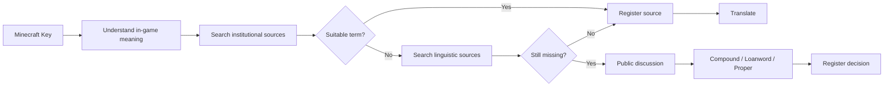

# Minecraft Mapuzungun
Comunitary and open translation of **Minecraft: Java Edition** into Mapuzungun/Mapuche language, using **Alfabeto Mapuche Unificado (AMU) graphemary** or Unified Mapuche Alphabet (UMA) as the main spelling standard.

>[!CAUTION]
>This project is not maintained, affiliated with, related to, or delegated by Mojang AB, Microsoft Corporation, or Xbox (Microsoft Gaming).

## Goals

Create a localization that is maintainable, traceable, and publicly reviewable. The project separates:

1. the original Minecraft keys
2. the Mapuzugun translations
3. the terminology glossary
4. the linguistic sources
5. the installable resource pack

The initial version targets **Minecraft Java 1.20.1**.

## Principles

- Primary spelling: **Alfabeto Mapuche Unificado (AMU)** or Unified Mapuche Alphabet (UMA).
- Source priority: CONADI (Corporación Nacional de Desarrollo Indígena de Chile), MINEDUC (Ministerio de Educación de Chile) and institutional educational material; followed by other documented linguistic sources.
- Do not translate literally from Spanish or other languages.
- Do not invent neologisms without documenting them.
- Minecraft proper nouns may be left untranslated when that is the clearest option.
- All debatable decisions must be documented.
- Mojang's `en_us.json` is not redistributed in this repository. Each contributor can extract it from their own installation to compare keys.

## Language code

This project uses:
```text
arn_cl
```

`arn` corresponds to the ISO 639-3 identifier used for Mapudungun/Mapuzugun; `_cl` distinguishes this locale from other dialects in the project. It is a technical identifier for the resource pack, not a declaration that an official Minecraft locale with that code exists.

## Recommended workflow for each term



## What NOT to do

Do not accept translations of the following type:

```text
English → Google Translate → Spanish → Mapuzugun
```

Do not mix writing systems without indicating it. If a source uses the Unified Writing System (Grafemario Unificado), Raguileo, or another orthography, the conversion to Azümchefe must be reviewed; automatic substitutions are not sufficient.

## Licenses

- Translations, documentation, and the glossary created by the project: **CC BY-SA 4.0**, unless otherwise indicated.
- Scripts in `tools/`: **MIT**.
- Minecraft, its original text, and its trademarks belong to their respective owners. This project is not affiliated with or endorsed by Mojang Studios or Microsoft.

See `LICENSES.md`.
